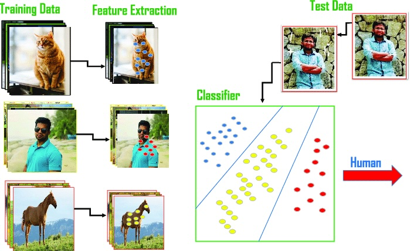

# comparingclassifiers
GitHub Repository for work done on Professional Certificate in Machine Learning and Artificial Intelligence - January 2025

# Practical Application Assignment 17.1: Comparing Classifiers

 ## Contents
- [Introduction](#introduction)
- [How to Use the Files in This Repository](#how-to-use-the-files-in-this-repository)
- [Business Understanding](#business-understanding)
- [Data Understanding](#data-understanding)
- [Data Preparation](#data-preparation)
- [Baseline Model Comparison](#Baseline-Model-Comparison)
- [Model Comparisons](#Model-Comparisons)
- [Improving the Model](#Improving-the-Model)
- [Findings](#findings)
- [Next Steps and Recommendations](#next-steps-and-recommendations)

## Introduction

Practical Application Assignment 17.1: Bank Marketing Analysis

This repository contains the Jupyter Notebook for Practical Application Assignment 17.1. In this project, we'll analyze a dataset from a Portuguese banking institution, available at [UCI Machine Learning Repository](https://archive.ics.uci.edu/ml/datasets/bank+marketing). The dataset, titled "bank-additional-full.csv", contains information on past marketing campaigns.

My goal is to build and compare the performance of classifiers of various machine learning models for predicting customer responses to long-term deposit applications. We'll explore models like **K-Nearest Neighbors, Logistic Regression, Decision Trees** and **Support Vector Machines**. By analyzing features such as job, marital status, education, housing situation, and existing loans, we aim to identify patterns that can help the bank better evaluate customer receptiveness to these long-term deposit offers.

## How to Use the Files in This Repository

The repository is organized into the following directories and files:

- **data**: Contains the `bank-additional-full.csv` dataset used for training the machine learning models.
- **images**: Stores image files used in the Jupyter Notebook and the project documentation.
- **notebooks**: Contains the Jupyter Notebook titled **Practical Application III: Comparing Classifiers**, which performs the data analysis and builds the machine learning models.

### To use the files:
1. Clone or download the repository.
2. Open the Jupyter Notebook (**Practical Application III: Comparing Classifiers**).
3. Run the cells sequentially to analyze the data, build the model, and view the results.

Ensure that you have the necessary libraries installed, such as:
- `pandas`
- `numpy`
- `matplotlib`
- `scikit-learn`
- `scipy-stats`
---

## Business Understanding

This study examines a dataset from a Portuguese bank that implemented a series of 17 targeted telemarketing campaigns between 2008 and 2010 to promote long-term deposit subscriptions. These campaigns primarily utilized outbound calls to clients, with some supplementary online banking interactions. The dataset encompasses 79,354 client contacts, each with detailed attributes such as demographics, financial history, and campaign interactions.

The overall success rate of these campaigns was relatively low, with only 8% of contacts resulting in successful term deposit subscriptions (6,499 out of 79,354). This analysis aims to gain a deeper understanding of the factors influencing campaign success and identify key predictors of customer receptiveness to these offers.

The bank now aims to improve the effectiveness of future campaigns. To achieve this, we will utilize a classification approach within the machine learning framework. Classification is a supervised learning technique where the model learns to predict the class or category of an input based on labeled training data. In this case, the model will learn to predict whether a customer will subscribe to a term deposit based on historical campaign data. The trained model will then be evaluated on unseen data to assess its predictive accuracy before being implemented in live campaigns.

Picture above shows an example of a classification work flow shows the object classification across three different classes (cat, human and horse) to identify a human

Source - [https://www.datacamp.com/blog/classification-machine-learning](https://www.researchgate.net/figure/Example-of-machine-learning-work-flow-for-object-classification-across-three-different_fig1_350220438)

### Business Objective Definition

This project aims to analyze a dataset from a Portuguese banking institution to understand the factors that influence the success of their marketing campaigns for long-term deposit products.

Specifically, this analysis seeks to:

**Identify key customer attributes and campaign characteristics** that correlate with successful long-term deposit subscriptions.

**Determine the impact of various factors on campaign success:**

- Loan products: Analyze the impact of existing loans (e.g., housing loans) on customer receptiveness to long-term deposit offers.

- Education level: Investigate the influence of education level (e.g., university degree) on campaign outcomes.

- Contact methods: Assess the effectiveness of different contact methods (e.g., cellular, telephone) on customer engagement and conversion rates.

By identifying these key factors, the bank can optimize future marketing campaigns, target the most promising customer segments, and ultimately improve the overall success rate of their long-term deposit offerings.

## Data Understanding

The description of the data showed that:
- The mean of age of potential clients is about 40 years, with the youngest is 17 years and the oldest is 98 years. The distribution seems reasonably wide, given the high standard deviation (10.42)
- The duration of interactions exhibits significant variability, with a mean of 258.28 seconds and a high standard deviation of 259.28, ranging from 0 seconds, potentially indicating unsuccessful or extremely brief contacts, to an extreme of 4,918 seconds (approximately 82 minutes), which may suggest unusually prolonged interactions or data entry errors.
- The mean value of 2.57 suggests that most clients are contacted 2 to 3 times in a campaign, with a max of 56. Could be an error which seems to be an outlier (extremely high frequency) may need to be excluded later on.
- pdays (days since last contact) indicates the number of days since the last contact with a client. However, the majority of records have a value of 999, which typically represents clients who have not been previously contacted according to the database. 999 - may be commonly used as a placeholder for clients with no previous contact history.

**Data distribution of numerical features:**
- All numerical features in the dataset are non-normally distributed, and the null hypothesis of normality is rejected for each.
- This means we should consider alternative methods or transformations for handling the data
- We can see from the plot that 'age', 'duration', 'campaign', and 'previous' features are heavily skewed towards the left. Also  'campaign', and 'previous' seem to have some outliers.
- The majority of both acceptances and refusals of the subscription offer come from customers in their 30s.

A clear distinction exists between the 'yes' and 'no' categories in the **duration** feature. Generally, the longer the duration of the call, the higher the likelihood that a potential customer will subscribe to the term deposit.

Regarding the potential outliers in the three features mentioned, the following scenarios are possible:
- **pdays**: Contacting a lead after more than 1000 days is atypical, but still plausible. Sometimes, the customer might have been removed from the marketing list but later added back after showing renewed interest. It’s also possible that the system continued to track days even after the customer was removed, which would explain the unusually high values.
- **campaign**: Being contacted more than 30 times within a single marketing campaign seems unusual. It raises the question of why the marketing team continued to reach out so many times—did they not consider the customer uninterested? Most organizations likely wouldn’t persist this long without reconsidering the customer’s engagement. This warrants a deeper investigation to understand why so many contacts were made.
- **previous**: Outliers in this feature, with values over 5, could be reasonable if a potential customer was part of multiple marketing campaigns. In such cases, it's possible that the customer’s data was recorded across several campaigns, which may explain the high values

**Data distribution of categorical features:**

- **Occupational Distribution**: Blue-collar workers, admin, and technicians represent approximately 60% of the total customer base.
- **Marital Status**: The majority of potential customers are married, with over 25,000 customers falling into this category.
- **Education**: Most potential customers have completed university degree.
- **Credit Default**: There is a clear imbalance in the 'default' feature, where most customers have no credit default. Despite the importance of this variable for assessing credit risk, it appears to have little correlation with the likelihood of subscribing to a deposit.
- **Loan and Housing Loan Status**: A larger portion of potential customers do not have loans or housing loans compared to those who do.
- **Preferred Contact Method**: Cellular is the predominant contact method. 
- **Marketing Activity**: May saw the highest volume of marketing activities, while December recorded the fewest.
- **Previous Campaign Outcomes**: The results of previous campaigns are mostly nonexistent, yet all customers listed in the dataset have been involved in previous campaigns, as indicated by the `pdays` feature.

Additional plots are provided below for visualization on some of the features of the dataset.

 
  
  
  
  

## Findings on Data

This analysis examined factors influencing term deposit subscriptions at a Portuguese bank. Here are the key takeaways:
* **Age:** Surprisingly, the highest subscription rates were for the youngest (20s) and oldest (60+) age groups.
* **Employment:** Unemployed, retired, and student demographics had higher subscription rates than most employed groups. Blue-collar workers had the lowest rate.
* **Marital Status:** Single individuals subscribed more than married or divorced.
* **Education:** The relationship between education and subscription wasn't clear. Lower education generally had lower rates, but a university degree also had a relatively low rate.
* **Loans:** Individuals with housing loans had a slightly higher subscription rate than those without. Personal loans showed a weak negative correlation with subscriptions.
* **Contact Method:** Cellular phone contact resulted in a significantly higher subscription rate compared to traditional phone calls. Call duration also had a positive correlation with successful subscriptions.

These findings suggest the bank can improve targeting by focusing on younger, older, unemployed, retired, student, and single demographics. Cellular outreach with longer call durations might also be more effective. Further analysis into factors like income and financial knowledge might be beneficial.

## Data Preparation

To prepare the dataset for modeling, several steps were taken:
**Data Cleaning:**
The target variable "Y" was renamed to "deposit" for better readability and interpretability.

**Feature Selection:**
An initial set of features was selected: 'job', 'marital', 'education', 'default', 'housing', 'loan', and 'contact'.

**Data Transformation:**
ColumnTransformer was employed to apply appropriate transformations to different data types:

**Categorical Features:** Transformed using techniques like one-hot encoding or label encoding.

**Numerical Features:** Transformed using techniques like scaling or normalization.

**Target Encoding:** The target variable ("deposit") was encoded using LabelEncoder to convert categorical labels (e.g., "yes", "no") into numerical values (e.g., 1, 0).

**Data Splitting:** The dataset was divided into training and testing sets using train_test_split. 30% of the data was allocated to the test set for unbiased model evaluation.
This data preparation process ensures that the data is in a suitable format for machine learning model training and evaluation.

## Baseline Model
For the baseline model, a DecisionTreeClassifier was chosen. This algorithm is well-suited for multi-class classification tasks. Decision Trees operate by recursively partitioning the data based on different feature subsets and applying decision rules at each node to create a hierarchical structure for making predictions.

- In the context of our Decision Tree Classifier, the confusion matrix reveals a high number of True Positives (TPs) where the model correctly predicted 'No' (indicating no subscription to the long-term product), while the number of True Negatives (TNs) appears to be zero.
- While the model exhibits an overall accuracy of 0.89, further analysis reveals concerningly low recall and precision scores ( below 0.51).
- Low Recall: Indicates a high number of False Negatives, meaning the model incorrectly predicted that customers would not subscribe when they actually did. This could be attributed to class imbalance within the dataset (where "No" subscriptions are significantly more frequent) or suboptimal model hyperparameters.
- Low Precision: Suggests a high number of False Positives, meaning the model incorrectly predicted that customers would subscribe when they did not. This issue also might be linked to class imbalance or insufficient model tuning.
- The observed high number of TPs in the confusion matrix, despite the low recall and precision, is likely a consequence of the dataset's strong bias towards "No" subscriptions. In such cases, the model may be overly inclined to predict the majority class ('No') to achieve high accuracy, even if it misclassifies a significant portion of the minority class ('Yes').

## Model Comparisons

To establish a baseline for comparison, we will evaluate the performance of four common classification algorithms: Logistic Regression, KNN, Decision Tree, and SVM. Using the default settings for each model, we will train and evaluate their performance on the dataset. This comparison will provide insights into the relative strengths and weaknesses of each model and guide further model selection and optimization.

Logistic Regression emerged as the most efficient and accurate model. It achieved the highest training and testing accuracies while also exhibiting the fastest training time, making it a strong contender for this classification task.

## Improving the Model

**Feature Engineering and Exploration:**

We explored the features for their importance in predicting target variable. We visualize the relationship between features and the target variable using techniques like box plot. This helped us to identify the feature that doesn't add meaningful value to the predictions, it might be best to remove it or transform it into a more meaningful feature.

**GridsearchCV of all the models**

As per the result of the best-performing hyperparameters and their corresponding scores for different models:
- Logistic Regression
Best Parameters: 'C': 0.01, 'solver': 'liblinear'
Best Score: 0.8873441
- K-Nearest Neighbors (KNN)
Best Parameters: 'metric': 'euclidean', 'n_neighbors': 3
Best Score: 0.8803032
- Decision Tree
Best Parameters: 'max_depth': None, 'min_samples_leaf': 1
Best Score: 0.8872233
- Support Vector Machine (SVM)
Best Parameters: 'C': 0.1, 'gamma': 'scale', 'kernel': 'linear'
Best Score: 0.887344

**Findings:**
- The Logistic Regression and SVM models both achieved the highest score of 0.887344, making them the best performers among the models tested.
- The KNN model had a slightly lower score of 0.8803032, while the Decision Tree was very close to the top performers with a score of 0.8872233.
- This suggests that for this particular task, Logistic Regression and SVM with the specified hyperparameters are the most effective models.

## Next Steps and Recommendations

A key challenge in this analysis is the imbalanced dataset, with a significant overrepresentation of unsuccessful marketing campaigns.

If the goal is to understand the factors contributing to campaign failures, the developed models can provide valuable insights.

Alternatively, these models can help the bank identify and target customer segments more effectively. For instance, if the models indicate that customers contacted via cellular calls with longer durations exhibit higher success rates, the bank could explore alternative channels like text messaging, video calls (e.g., Zoom), and potentially leverage social media platforms for younger demographics (e.g., customers in their 20s and 30s) to improve campaign outcomes.
